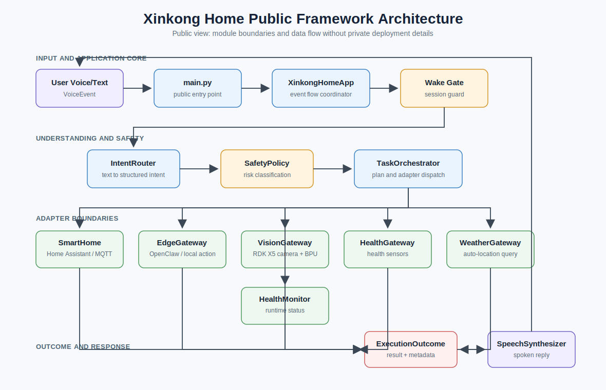
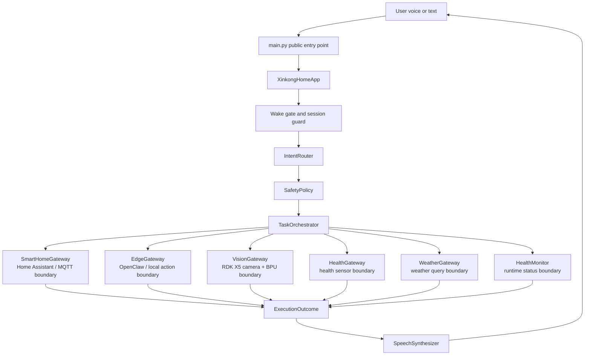

# Architecture Overview

This public repository exposes the system shape of Xinkong Home without publishing the full private implementation.

## Main Modules

```text
main.py
  -> config.load_public_config()
  -> factory.build_public_demo_app()
  -> XinkongHomeApp.handle_voice_event()
  -> IntentRouter.route()
  -> TaskOrchestrator.plan()
  -> SafetyPolicy.classify()
  -> adapter dispatch
  -> speech reply
```

## System Architecture



The static image above is included so the architecture is visible in GitHub and common Markdown preview tools. The Mermaid source below is kept as an editable text version of the same flow.



## Runtime Responsibilities

- `config.py`: loads redacted public configuration.
- `models.py`: defines public dataclasses for voice events, intents, tasks, outcomes, BPU summaries, and health checks.
- `nlu.py`: shows a small keyword router. The private version has richer Chinese command normalization and noisy-scene handling.
- `safety.py`: shows the risk policy boundary. The private policy details are not included.
- `orchestrator.py`: shows task planning and adapter dispatch.
- `adapters.py`: defines integration protocols and simulated adapters.
- `app.py`: ties wake gating, routing, planning, execution, and reply assembly together.
- `factory.py`: builds a simulated public runtime.

## Adapter Boundary

The private system connects to real services and hardware:

- Home Assistant REST/MQTT for device control.
- OpenClaw/local gateway for edge actions and automatic recovery.
- RDK X5 camera and BPU inference for local visual understanding.
- ESP32/MQTT sensors and actuators.
- Local and cloud speech services.
- Runtime watchdog and health dashboard.

This repository keeps those as protocols and simulations so the framework is understandable without exposing deployment secrets or model assets.

## RDK X5 Role

RDK X5 is the edge node that coordinates local perception, voice interaction, smart-home control, and runtime health. The private project uses RDK-specific services and model files that are intentionally not published here.

## Feature Matrix

See `docs/system_overview.md` for a concise table of public modules, runtime roles, and private implementation boundaries.
